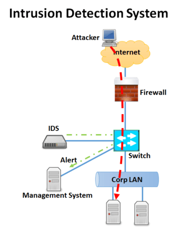
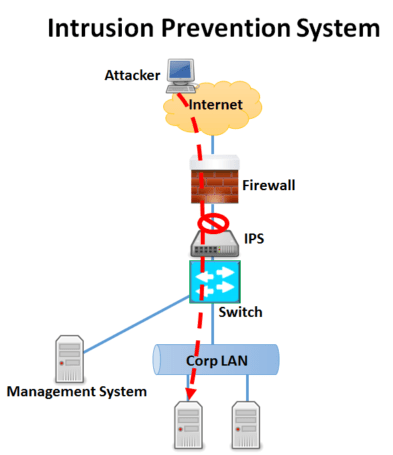

#2.0 Intrusion Detection System (IDS) and Intrusion Prevention System (IPS)

&nbsp;&nbsp;&nbsp;&nbsp;&nbsp;&nbsp;&nbsp;&nbsp;Firewalls are not enough to protect a system from potential threats and attacks. Because firewall can be also beaten in cyber war or attack. Furthermore, if it is configured wrong, then it will gradually decrease the network traffic of the system because it may obstruct all or highly portion of the incoming traffic so that useful information or even alerts coming from other systems etc. cannot be reached. Hence, firewall cannot be used by itself. Some other protection tools must or even have to be used in the system to increase the security as well. Two of those protection tools called <strong>Intrusion Detection System (IDS)</strong> and <strong>Intrusion Prevention System (IPS)</strong> are described and given pros and cons thereof below.

## &nbsp;&nbsp;&nbsp;&nbsp;2.1 Intrusion Detection System

{: style="border: 3px solid  black;height:42%;width:42%;margin:10px 10px", align=right}

&nbsp;&nbsp;&nbsp;&nbsp;&nbsp;&nbsp;&nbsp;&nbsp;An intrusion detection system's (IDS) job is to find dangers in network traffic and then notify a network administrator with a report or a warning. Thus, the threat within the system won't be removed by it. The IDS then reviews a copy of the traffic. Since the IDS device processes its own copy, it adds no latency to network traffic.

&nbsp;&nbsp;&nbsp;&nbsp;&nbsp;&nbsp;&nbsp;&nbsp;Installing intrusion detection systems is crucial in any area where network traffic from outside sources is permitted to enter private or controlled networks. For instance, as Figure 4 depicts a lot of businesses with Internet access decide to put in place network-based intrusion detection systems both behind firewalls and in their DMZ networks.

Figure 4. IDS operation (IDS IPS, n.d.)&nbsp;&nbsp;&nbsp;&nbsp;&nbsp;&nbsp;&nbsp;

### &nbsp;&nbsp;&nbsp;&nbsp;&nbsp;&nbsp;&nbsp;&nbsp;2.1.1 Intrusion Detection Methodology

&nbsp;&nbsp;&nbsp;&nbsp;&nbsp;&nbsp;&nbsp;&nbsp;The variety in network configuration allows for the availability of multiple types of intrusion detection methodologies. They all have unique benefits and drawbacks in terms of detection, configuration, and price.

#### &nbsp;&nbsp;&nbsp;&nbsp;&nbsp;&nbsp;&nbsp;&nbsp;&nbsp;&nbsp;&nbsp;&nbsp;2.1.1.1 Signature Based Detection

&nbsp;&nbsp;&nbsp;&nbsp;&nbsp;&nbsp;&nbsp;&nbsp;A pattern associated with a recognized threat is called a signature. In signature-based detection, potential undesired traffic is found by comparing observed events to pre-defined signatures. This kind of detecting method is incredibly quick and easy to configure. When it comes to identifying unknown threats, signature-based detection is mainly ineffective. However, it is highly effective in identifying known threats.

#### &nbsp;&nbsp;&nbsp;&nbsp;&nbsp;&nbsp;&nbsp;&nbsp;&nbsp;&nbsp;&nbsp;&nbsp;2.1.1.2 Anomaly Based Detection

&nbsp;&nbsp;&nbsp;&nbsp;&nbsp;&nbsp;&nbsp;&nbsp;The practice of comparing definitions of what constitutes normal behavior to actual occurrences in order to spot notable anomalies is known as anomaly-based detection. The main advantage of anomaly-based detection techniques is their potential utility in identifying undesired traffic that is not explicitly known. It simply signals that something is abnormal rather than identifying a specific sort of malformation.

#### &nbsp;&nbsp;&nbsp;&nbsp;&nbsp;&nbsp;&nbsp;&nbsp;&nbsp;&nbsp;&nbsp;&nbsp;2.1.1.3 Stateful Protocol Analysis

&nbsp;&nbsp;&nbsp;&nbsp;&nbsp;&nbsp;&nbsp;&nbsp;The practice of comparing preset profiles of widely recognized criteria of benign protocol activity at each protocol state against observed events in order to spot deviations is known as <strong>stateful protocol analysis</strong>.

### &nbsp;&nbsp;&nbsp;&nbsp;&nbsp;&nbsp;&nbsp;&nbsp;2.1.2 Types of Intrusion Detection System

&nbsp;&nbsp;&nbsp;&nbsp;&nbsp;&nbsp;&nbsp;&nbsp;Based on the kinds of events they monitor and how they are implemented, intrusion detection systems have variety of forms. In this document, we address the four types that follow:

- Network Based IDS
- Wireless IDS
- Network Behavior Anomaly Detection
- Host Based IDS

#### &nbsp;&nbsp;&nbsp;&nbsp;&nbsp;&nbsp;&nbsp;&nbsp;&nbsp;&nbsp;&nbsp;&nbsp;2.1.2.1 Network Based Ids

&nbsp;&nbsp;&nbsp;&nbsp;&nbsp;&nbsp;&nbsp;&nbsp;These devices keep an eye on network activity in search of signs of an attack. Simply put, attack signatures are character strings that are frequently seen throughout an attack. Because a single system can monitor several systems and resources, network-based intrusion detection is typically more successful than host-based intrusion detection. Problems with network-based intrusion detection include:

- 
Attack signatures that are dispersed over several packets are often missed by network-based intrusion systems.

- 
It is not appropriate for protecting every host on the network.

- 
A lot of intrusion detection systems are devoid of the features required to recognize attacks at the network layer. In other words, not every assault will have a recognizable attack signature.

#### &nbsp;&nbsp;&nbsp;&nbsp;&nbsp;&nbsp;&nbsp;&nbsp;&nbsp;&nbsp;&nbsp;&nbsp;2.1.2.2 Wireless Ids

&nbsp;&nbsp;&nbsp;&nbsp;&nbsp;&nbsp;&nbsp;&nbsp;In that it is capable of analyzing network traffic, a WLAN intrusion detection system (IDS) is comparable to an NIDS. It will, however, also examine wireless-specific traffic, such as looking for users outside of the company's physical boundaries and external users attempting to connect to access points (AP).

#### &nbsp;&nbsp;&nbsp;&nbsp;&nbsp;&nbsp;&nbsp;&nbsp;&nbsp;&nbsp;&nbsp;&nbsp;2.1.2.3 Network Behavior Anomaly Detection

&nbsp;&nbsp;&nbsp;&nbsp;&nbsp;&nbsp;&nbsp;&nbsp;Network behaviour anomaly detection (NBAD) examines network segment traffic to look for any anomalies in the amount or type of the traffic.

#### &nbsp;&nbsp;&nbsp;&nbsp;&nbsp;&nbsp;&nbsp;&nbsp;&nbsp;&nbsp;&nbsp;&nbsp;2.1.2.4 Host Based Ids

&nbsp;&nbsp;&nbsp;&nbsp;&nbsp;&nbsp;&nbsp;&nbsp;Software agents are installed on each computer host connected to the network in host-based intrusion detection system (HIDS) technology in order to monitor events that happen exclusively on that host. Network traffic and system-specific configurations, including software calls, local security policies, audits of local logs, and more, are analyzed by HIDS. The majority of the time, HIDS are installed on critical hosts, like servers that are open to the public and those that hold private data. However, they result in a significant overhead for the hosts who employ them.

## &nbsp;&nbsp;&nbsp;&nbsp;2.2 Intrusion Prevention System

{: style="border: 3px solid  black;height:36%;width:36%;margin:10px 10px", align=right}

&nbsp;&nbsp;&nbsp;&nbsp;&nbsp;&nbsp;&nbsp;&nbsp;<strong>Intrusion Prevention System</strong>, or <strong>IPS</strong>, monitor spacket traffic in real time for malicious activity or patterns that match. When these patterns are detected, it can generate warnings and drop or block the traffic in real time as it passes across the network. The key functionalities performed by an IPS are as follows:

- IPS detects and takes preventive actions against malicious attacks
- IPS stops the attack itself
- IPS changes the security environment
- IPS changes the attack’s contents

Figure 5. IPS operation (IDS IPS, n.d.)&nbsp;&nbsp;

## &nbsp;&nbsp;&nbsp;&nbsp;2.3 Difference between IPS and Firewall Systems

&nbsp;&nbsp;&nbsp;&nbsp;&nbsp;&nbsp;&nbsp;&nbsp;When compared to a firewall, an IPS is superior. Firewalls and intrusion prevention systems (IPS) are control mechanisms. They sit between two networks and manage the traffic that passes across them. The primary distinction between a firewall and an intrusion prevention system is how they manage network traffic. Whereas a firewall blocks all requests that do not meet its safety definition, an intrusion prevention system (IPS) permits all requests save those whose contents appear to be malicious and potentially dangerous to the system.

## &nbsp;&nbsp;&nbsp;&nbsp;2.4 Snort

&nbsp;&nbsp;&nbsp;&nbsp;&nbsp;&nbsp;&nbsp;&nbsp;This application comes from the well-known <strong>tcpdump</strong>, a sniffer that is included in every UNIX system. Snort is an open-source application, which implies that the entire solution is free to use and that you can modify any component of the source code. You can also make your own rules. Finally, you may set Snort to work with your firewall to create a complete IPS system. Definitions can be used to notify the administrator, monitoring server, or firewall at the output module. The output format can also be defined.

&nbsp;&nbsp;&nbsp;&nbsp;&nbsp;&nbsp;&nbsp;&nbsp;Although SNORT is a main program and one of the oldest programs in IDS/IPS systems, there are also newly-developed programs like <strong>Suricata</strong> in this field.

## &nbsp;&nbsp;&nbsp;&nbsp;2.5 Attack Types to IDS/IPS Systems

&nbsp;&nbsp;&nbsp;&nbsp;&nbsp;&nbsp;&nbsp;&nbsp;IDSs are common defense systems at the packet-based network layer. Attackers intend to circumvent this systems using three sorts of generic attacks.

### &nbsp;&nbsp;&nbsp;&nbsp;&nbsp;&nbsp;&nbsp;&nbsp;2.5.1 Evasion Attack

&nbsp;&nbsp;&nbsp;&nbsp;&nbsp;&nbsp;&nbsp;&nbsp;Packets are sent to both the IDS and the target in these assaults. Although the IDS rejects these packets (not because they are attacks), the target host accepts them. Because the IDS does not check the content of the packets it rejects or drops, it cannot determine whether they are an attack or not. Thus, the attacker sends some or all of the malicious traffic to the network, without being controlled by the IDS.

### &nbsp;&nbsp;&nbsp;&nbsp;&nbsp;&nbsp;&nbsp;&nbsp;2.5.2 Insertion Attack

&nbsp;&nbsp;&nbsp;&nbsp;&nbsp;&nbsp;&nbsp;&nbsp;In these attacks; Among the packages sent to both the end user and the IDS, there may be some that are accepted by the IDS that the end user does not accept. The package is only valid on IDS. The attacker who can use this situation appropriately; By adding an appropriate packet traffic, it can prevent analysis in attack detection with signature analysis. Because with a packet that is not accepted by the end user, the IDS is convinced that that packet group is not an attack.

### &nbsp;&nbsp;&nbsp;&nbsp;&nbsp;&nbsp;&nbsp;&nbsp;2.5.3 Denial-of-service (DoS) Attack

&nbsp;&nbsp;&nbsp;&nbsp;&nbsp;&nbsp;&nbsp;&nbsp;These are attacks aimed at consuming or completely disabling IDS or system resources. In this way, IDS becomes unable to analyze all incoming traffic. The most common type or feature of a DoS attack is that it overwhelms the victim with its requests. If these requests are sent from more than one source at a time, it is called a distributed DoS (DDoS) attack.

